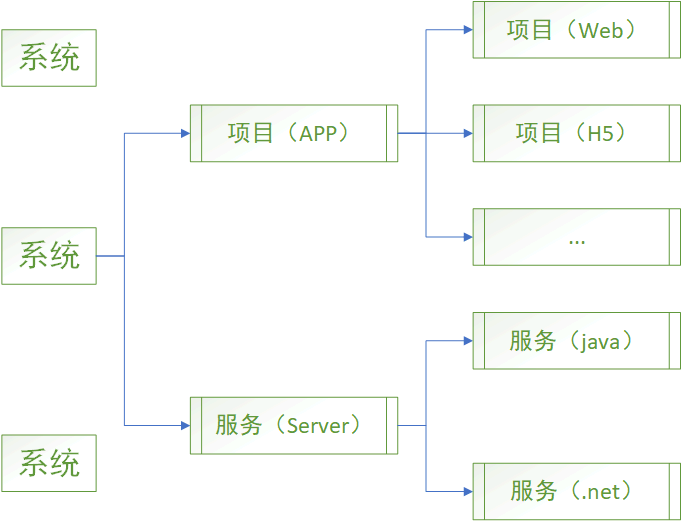
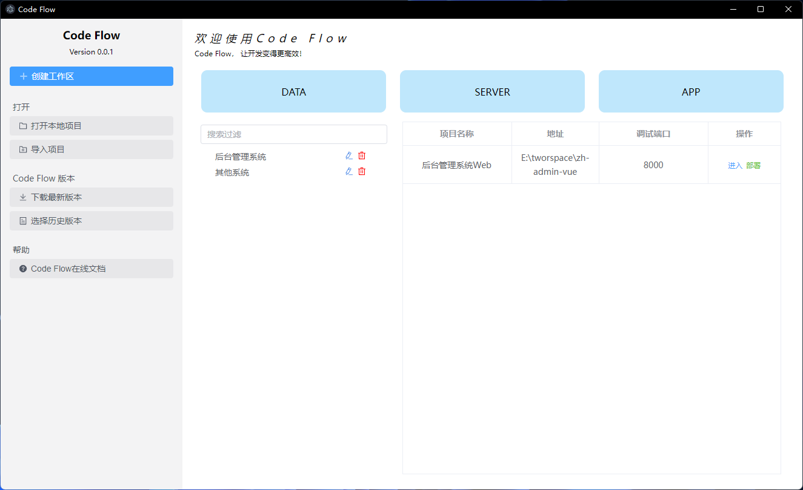
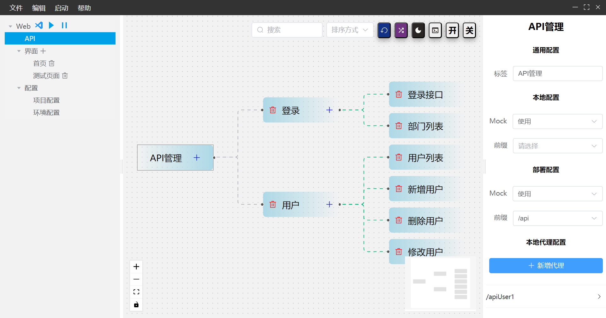
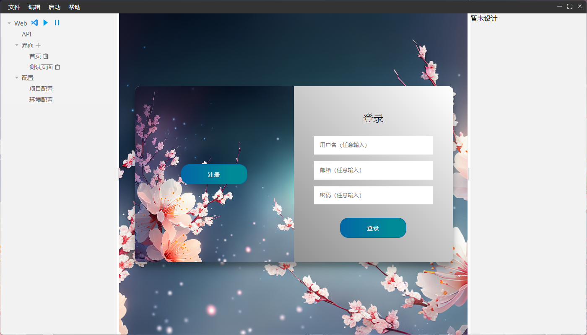
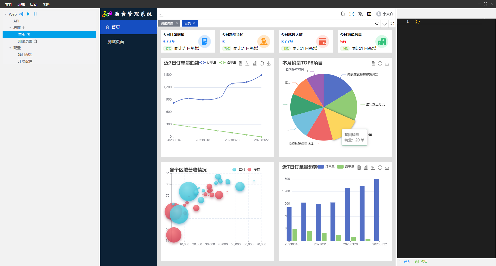
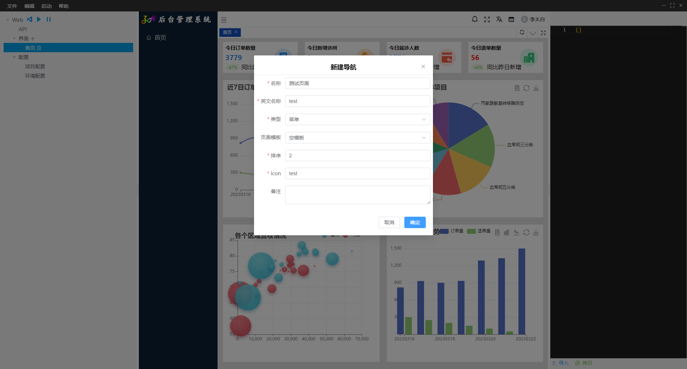
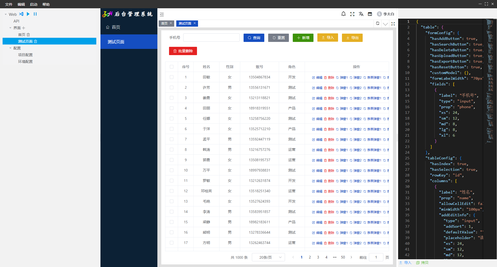
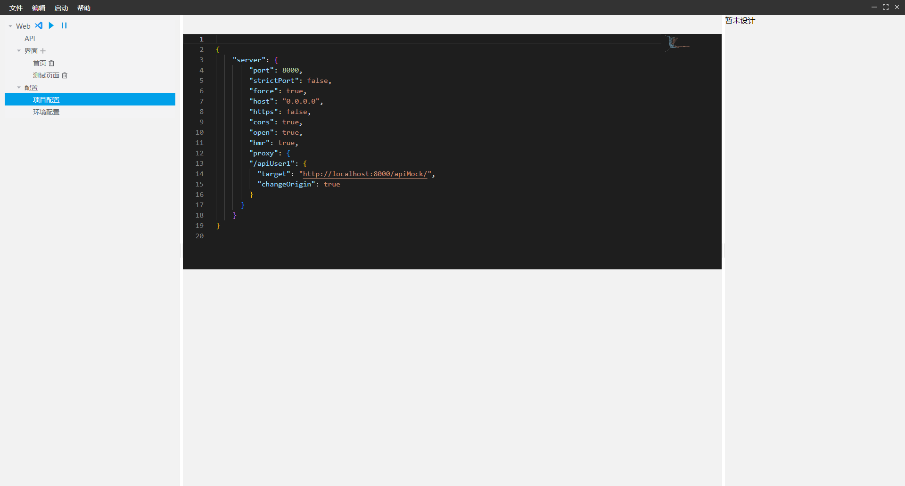
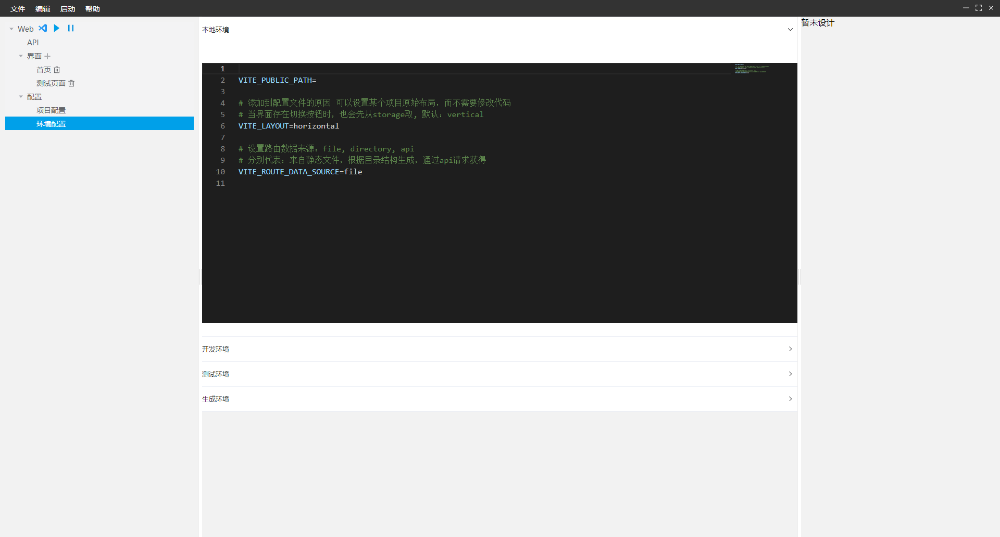

# CodeFlow
渐进式低代码开发管理工具
###### 目前仅支持前端开发的使用。

## 简介
通过界面化操作，简化工作流程。
### 目前项目支持情况
#### 前端
#### vue3

## 软件构想图

## 目前功能与界面

## 功能
### 前端Web
1. 支持工程管理，将不同的项目归纳到一个工程下进行管理
2. 支持项目，在本地运行，git管理，部署等常见工作任务
3. 支持在vs code打开代码，直接修改代码
4. 支持API、常见页面的可视化操作
5. 支持通过页面对配置进行修改

#### 首页

#### API管理界面

#### 登录页

#### 页面首页

#### 新建页面或菜单

#### 测试页面

#### 项目配置

#### 环境配置
